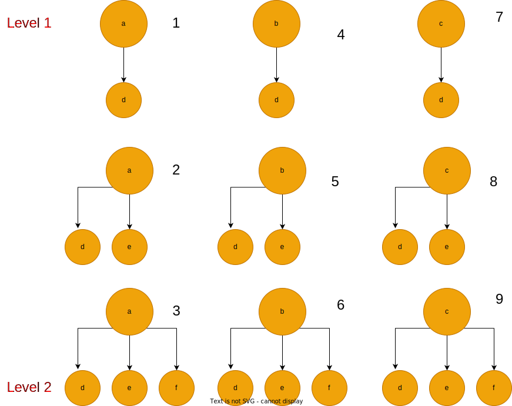

​																							**This post is under construction! ***

## Introduction

#### 1. [2Sum](https://leetcode.com/problems/two-sum/)

- Description

  This is one of the most famous algorithm problems among interviewers, I do not know why they like it, but I know it contains multiple tricks which could be useful when you are solving other problems. 

  In this problem, we are given **a list of integers**, and we want to find **two numbers** that add up to **a given target**.

- Solution Intuition

  ##### **1. Brute Force Solution**

  The intuitive approach to solve the problem is by making three for-loops (i, j), then iteratively, we look for a combination of two numbers that add up to the target value.

  ```python
  def twoSum(nums, target):
  
      n = len(nums)
  
      for i in range(n):
          for j in range(i + 1, n):
  
              if nums[i] + nums[j] == target:
                  return [i, j]
  
  ```

  This solution has time complexity $O(n^2)$, and space complexity $O(1)$. Even though, this algorithm is efficient in term of space complexity, it is not practical in terms of time complexity.

  

  **2. Optimized Solution**

  We can work around the brute force solution by relying on the space complexity. One of the most useful data structure that programmers like to use is hashmap. Hashmap has the property of $O(1)$ time complexity for the access operation of any element, **therefore what we can do is to store all elements of a list inside a hashmap. Then we can loop over the list and any time we will query our hashmap using a key that has value : target - nums[i], where i is the loop variable, and nums is the list of integers. ** 

  ```python
  def twoSum(nums, target):
  
      mapper = {}
      for i, e in enumerate(nums): # Store the numbers inside the hashmap,
          						 # where the keys are the numbers, and the values are the coressponding indicies.
              					 #  time complexity = O(n).
          mapper[e] = i
  
      for i in range(len(nums)): # Loop over the list of numbers
  
          b = target - nums[i]   # get the key value
  
          if b in mapper and mapper[b] != i:  # if the key is existed in the hashmap and the its value 
              								# does not equal to the index of the second number, we return
                  							# the indicies.
              return (i, mapper[b])
  
  ```

  This algorithm has time complexity O(n), and space complexity O(n). 

#### 2. [3Sum](https://leetcode.com/problems/3sum/)

- Problem Description

  This problem is similar to the [2Sum](#2Sum) problem that we saw earlier. We are given a list of integers, and we want to find **three numbers** that add up to **zero**. In such way, the triplets should be all unique.

- Solution Intuition

  ##### **1. Brute Force Solution**

  The intuitive approach to solve the problem is by making three for-loops (i, j, k), then iteratively, we look for a combination of three numbers that add up to zero.

```python
def threeSum(nums):

    n = len(nums)
    target = 0
    result = []
    for i in range(n):
        for j in range(i + 1, n):
            for k in range(j + 1, n):

                sum_num = nums[i] + nums[j] + nums[k]
                sum_comb = [nums[i], nums[j], nums[k]]

                if (
                    sum_num == target
                    and i != j
                    and j != k
                    and i != k
                    and sorted(sum_comb) not in result
                ):
                    result.append(sorted(sum_comb))

    return result

```

Problem with this solution is the time Complexity is O(n^3) and Space Complexity is O(n), which is not practical in real-world applications. So the question here: **Can we do better and optimize this time complexity?**

**2. Optimized Solution**

The answer is yes!, and by using "Two Pointers" approach. The idea is as following:

1. Sort the array of integers in increasing order.
2. Create a result set to hold the combinations of triplets.
3. While looping over the array using variable (i)
   1. Initialize two pointers, left pointer and has value i+1, and right pointer which has value equal to n-1, where n = array size.
   2. Make another loop and traverse the array using the two pointers, if nums[left] + nums[right] + nums[i] equals to zero, we will add this to the set of results. if nums[left] + nums[right] + nums[i] < zero, that means we need to increase the left pointer to increase the value of this summation. And finally, if f nums[left] + nums[right] + nums[i] > 0, that means we need to decrease the right pointer to decrease the value of the summation and push it towards being zero.
4. Finally, we return the set of result.

**Note**: I use set data structure to hold the combination of the triplets, to work around the duplication requirement.

```python
def threeSum(nums):

    nums = sorted(nums)
    n = len(nums)
    result = set()

    for i in range(n):

        left = i + 1
        right = n - 1
        target = 0 - nums[i]

        while left < right:

            combination_sum = nums[left] + nums[right]
            if combination_sum == target:
                result.add((nums[i], nums[left], nums[right]))
                left += 1
                right -= 1

            elif combination_sum < target:
                left += 1
            else:
                right -= 1

    return result
```


#### 3. [4Sum](https://leetcode.com/problems/4sum/)

- Problem Description

  This problem is also one of kSum problems family, we have seen several version of kSum problems in this post, 2Sum, 3Sum and now 4Sum. 

  Given a list of integers and a target, we want to find any set of 4 numbers from this list that add up to that target, where those sets are all unique.

- Solution Intuition

  

  **1. Brute Force Solution**

  A brute force solution to this probelm is to make four for-loops (i, j, k, l), then iteratively, we look for a combination of four numbers that add up to that target value.

  **2. Optimized Solution**

  2Sum and 3Sum problems have given us a pattern to solve any kSum problem including 4Sum. This pattern could be seen as:

  

  **Number of Targets = number of equation terms - 1**

  **Number of Outer-For-Loops = Number of targets - 1**

  

  wait wait wait, waleed, could you explain more? ok sure, In 2Sum we just needed to 1 for-loop to find all the combinations that form the target. In 3Sum, we needed 2 for-loops to find all the combinations. In 4Sum, we will need 3 for-loops to find all the combinations. Let's jump to the code to see how that works:

  ```python
  def fourSum(nums, target):
  
      nums = sorted(nums)
      n = len(nums)
      result = set()
  
      for i in range(n): # first loop
          first_taget = target - nums[i] # target 1
          for j in range(i + 1, n): # Second loop
              second_target = first_target - nums[j]  # target 2
              left = j + 1		
              right = n - 1
  
              while left < right: # Third loop
                  if nums[left] + nums[right] == second_target:
                      result.add((nums[i], nums[j], nums[left], nums[right]))
                      left += 1
                      right -= 1
                  elif nums[left] + nums[right] < second_target:
                      left += 1
                  else:
                      right -= 1
      return result
  
  ```

  


#### 4. [Letter Combinations of a Phone Number](https://leetcode.com/problems/letter-combinations-of-a-phone-number/)

- Problem Description

  In this problem, out goal is to find all the letters combinations that we can make if we are provided with a phone number, given that we have an access to a hashmap that maps each number to a string.

  

  

  

  ​																									

  <p style="text-align: center;"> <b> Figure 1 : Telephone Keypad</b></p>

- Solution Intuition

  **1. Brute Force Solution**

  The naive way to solve this problem is by using 3 for-loops. First, we will loop over the digits, and for each digit we will map it to its corresponding string using the given hashmap. Second, while we are inside the first loop, we will create another loop over the characters that related to each string. Finally, we will create a loop over the previous results that produced by the last step of the concatenation, i.e result = [ "ad", "ae"] , and add each character to the strings inside the result list.

  This solution has time complexity O(n . m . k) where n = size of the digits array, m = size of the string array, k =size of the result array.

  We can approximate this time complexity to be: O(n.3.k) = O(nk), where m = 3 in this problem.

  

```python
def letterCombinations(digits):

    hashmap = {
        "1": "None",
        "2": ["a", "b", "c"],
        "3": ["d", "e", "f"],
        "4": ["g", "h", "i"],
        "5": ["j", "k", "l"],
        "6": ["m", "n", "o"],
        "7": ["p", "q", "r", "s"],
        "8": ["t", "u", "v"],
        "9": ["w", "x", "y", "z"],
    }

    n = len(digits)
    if n < 1:
        return []
    else:
        ans = [""]

        for i in range(n):
            digit = digits[i]
            string = list(hashmap[digit])
            bag = []

            for j in range(len(ans)):
                for k in range(len(string)):
                    bag.append(ans[j] + string[k])
            ans = bag

        return ans

```

**2. Optimized Solution**

we can optimize this solution in terms of space complexity by getting rid of the result list, and use Depth First Search (DFS) algorithm to find those combinations:

1. We will create "index" integer variable to keep track of the number inside the digits list.
2. We will create "path" string variable to keep track of each valid path that the algorithm approach it.
3. We will create "result" list to hold the combinations.
4. Then we will call "dfs" function which build a tree and save each path to the result list.





<p style="text-align: center;"> <b> Figure 2 : It shows the sequence of the dfs function calls </b></p>


The "dfs" function below is called as the previous digram shows. Each number in the digram represents a call to the "dfs" function. steps 3, 6 and 9 are where the algorithm find all the paths for each digit.

```python
def letterCombinations(digits):

    hashmap = {
        "1": "None",
        "2": ["a", "b", "c"],
        "3": ["d", "e", "f"],
        "4": ["g", "h", "i"],
        "5": ["j", "k", "l"],
        "6": ["m", "n", "o"],
        "7": ["p", "q", "r", "s"],
        "8": ["t", "u", "v"],
        "9": ["w", "x", "y", "z"],
    }

    def dfs(digits, index, dic, path, result):

        if index >= len(digits):
            result.append(path)
            return

        string = dic[str(digits[index])]

        for ch in string:
            dfs(digits, index + 1, dic, path + ch, result)

    if len(digits) <= 0:
        return []

    result = []
    index = 0
    path = ""

    dfs(digits, index, hashmap, path, result)

    return result

```

#### 5.  [Generate Parentheses](https://leetcode.com/problems/generate-parentheses/description/)

- Description
- Solution Intuition

```python
def generateParenthesis(self, n: int) -> List[str]:
    def generate(opening_count, closing_count, path, result):

        if opening_count > closing_count:
            return
        if opening_count < 0:
            return

        if closing_count < 0:
            return
        if opening_count == 0 and closing_count == 0:

            result.append(path)

        generate(opening_count - 1, closing_count, path + "(", result)
        generate(opening_count, closing_count - 1, path + ")", result)

    result = []
    path = ""
    opening_count = n
    closing_count = n

    generate(opening_count, closing_count, path, result)

    return result

```

#### 6.  [Container With Most Water](https://leetcode.com/problems/container-with-most-water/)

- Description

  The problem is about finding the maximum area that a water container can hold if you are given a list of heights,  where these heights represent all possible heights of the sides of that container.

  

  

  <p style="text-align: center;"> <b> Figure 3 : X axis represents container's heights categories, and Y axis represents container heights  values. </b></p>

  

- Solution Intuition

  1. **Brute Force Solution**

     we will make two for-loops, an outer loop which is represented by variable **i** and an inner loop which is represented by variable **j**. at each iteration of the outer loop, we will try to find the maximum area between height[i] and height [j].

  ```python
  def max_water_area(height):
  
      n = len(height)
      area = 0
      for i in range(n):
          for j in range(i + 1, n):
  
              h = min(height[i], height[j])
              w = j - i
              area = max(area, h * w)
  
      return area
  ```

Problem with solution:  Time Complexity: O(n^2)

**How we can optimize this solution?**  

**2. Optimized Solution**

Two pointers!.

What if we set two pointers, left pointer that points at the beginning of the list of heights and right pointer that points at the end of the list. Then, we will move one of the two pointer depending if the value that corresponding to that pointer is less than the other one. why? imagine if one of the container sides has height 10 and the other is 5 and the distance between the two sides is 7, then:

area = min(5, 10) x 7 = 35 

```python
def max_water_area(height):

    n = len(height)
    left = 0
    right = n - 1
    area = 0

    while left < right:
        w = right - left	# container width

        if height[left] <= height[right]: 
            h = height[left]	# Take the short left side as container height
            area = max(area, h * w)	# Calculate the area and take the maximum between current area and the previous one.

            left += 1	# move the left pointer by 1
        else:
            h = height[right]	# Take the short right side as container height
            area = max(area, h * w)

            right -= 1	# move the right pointer by 1, but in the opposite direction.

    return area
```
