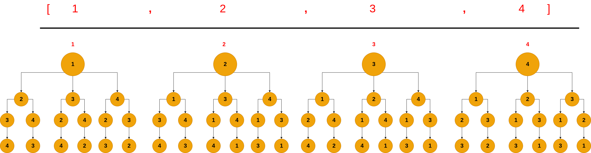
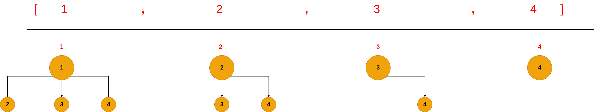

#### 1. [Permutations](https://leetcode.com/problems/permutations/)

- **Description**

  The permutation problem is one standard algorithms questions, and one of the most liked questions among interviewers. This problem shared a pattern that appears in other algorithm problems such as: [Combinations](https://leetcode.com/problems/combinations/), [Combinations Sum](https://leetcode.com/problems/combination-sum/), [ Combinations Sum II](https://leetcode.com/problems/combination-sum-ii/), [Letter combination of a phone number](https://leetcode.com/problems/letter-combinations-of-a-phone-number/), [Subsets](https://leetcode.com/problems/subsets/), [Subsets II](https://leetcode.com/problems/subsets-ii/) which we will discuss extensively in the upcoming posts.

  The problem is formalized as following: We are given a list of integers, and we want to find all the possible permutations that can be formed from this list.

- **Solution Intuition**

  The easiest way to think about this problem is by visualizing these permutations as a tree, and each path in the tree represents a valid permutation. Now, our problem becomes on how to traverse the list of integers in a way that we can visit all the paths in a tree, in other words, we are interested in to do tree traverse in a list of integers so that we can find all the valid paths which represent our sought permutations. Mathmatically this is formalized as:
  
  
  $$
  P_k^n = \frac{n!}{(n-k)!}
  $$
  
  
  
  
  Let us take an example, suppose that we are given list nums = [1,2,3,4], and our goal is to find all the possible permutations from this list. If we think about this problem as a tree problem and try to list all the permutations as tree, it will results in a tree as follows:
  
  
  
  
  
  
  
  Each path in the three represents a valid permutation, and each path is visited using depth first algorithm (DFS). In our example, the first path will be: [1,2,3,4], then [1,2,4,3], then [1,3,2,4], then [1,3,4,2], then [2,1,3,4], ... etc which are considered our valid permutations.
  
  
  
  Here is the following code of the above algorithm:
  
  ```python
  def permute(self, nums: List[int]) -> List[List[int]]:
    
      def dfs(nums, path, result):
  
          if len(nums) <= 0:		# A base condition to stop the recursion. When the there are no more items in the list that belong to 									# each node, the recursion will stop.
              result.append(path)
              return
  
          for i in range(len(nums)): # loop over the nodes that belong to a one level
              dfs(nums[0:i] + nums[i + 1 :], path + [nums[i]], result) # Call dfs function, while saving the nodes of each path in a list 																	 # called path.
  
      result = [] 
      path = []
  
      dfs(nums, path, result)
  
      return result
  
  ```
  
  

#### 2. [Combinations](https://leetcode.com/problems/combinations/)

- **Description**

  The combination problem is similar to the permutation problem that we have seen earlier. We are given a list of integers and  and we want to find all the possible combinations of k numbers, where k represents the number of chosen objects from the list.

  

  $$ C_k^n = \frac{n!}{k! . (n-k)!} $$

  

- **Solution Intuition**

  The solution will be as the permutation solution, except that we will do backtracking whenever the length of our path becomes to K. Let us take an example, suppose that we are given list nums = [1,2,3,4], and our goal is to find all the possible combinations from this list. If we think about this problem as a tree problem and try to list all the combinations as tree, it will results in a tree as follows:

  




We can observe that the number of paths has been shrunk, as the combination operation cares about the unique permutations and does not take into the account the repetitive ones. i.e [1,2] as the same as [2,1].

```python
def combine(n, k):
    def dfs(nums, path, result):

        if len(path) == k:   # base condition: just return paths that have length k.
            result.append(path)
            return

        for i in range(len(nums)):

            dfs(nums[i + 1 :], path + [nums[i]], result)

    nums = [i for i in range(1, n + 1)]

    result = []

    path = []

    dfs(nums, path, result)

    return result

```

