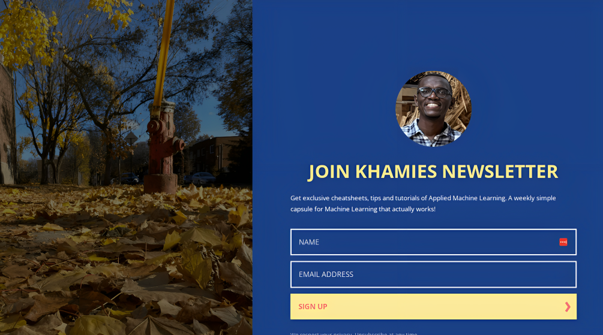

# About Me

##### Hi I am **{{ site.author.name }}** ,  an applied scientist. and ML grad. I am passionate about learning semantic representations from multimodal data. Also, I am interested in mapping these inferred meanings to autonomous actionable insights. 

##### **Previously**, I worked as research engineer intern at [Mila](https://mila.quebec/) under the supervision of [Liam Paull](https://liampaull.ca/), where my research focusing on developing deep learning models that suitable to robotics applications in noisy scenarios. I received my master at [AMMI](https://aimsammi.org/) in Mathematical sciences/Machine learning, where I worked in interpretability of reinforcement learning under the supervision of [George konidaris](http://cs.brown.edu/people/gdk/), previously I received my bachelor degree at [UofK](https://www.uofk.edu/en) in Electrical and electronics engineering, where I worked under the supervision of [Benjamin Rosman](https://www.benjaminrosman.com/).

##### **If** you are interested in learning more about Machine Learning, Algorithms, or Data Science, check out my recent blog posts from :point_right:  [here](https://blog.waleedkhamies.com/).

##### **Interested in explore my Github repos?**  if you find something interesting, collaboration or have some notes that help me improve, please drop me a message, I would love to hear your opinion, and suggestions.

##### **Also**, if you feel lazy to scroll! you can find an organized portfolio to my work :point_right: [here](https://waleedkhamies.com/projects/).

##### **Finally**, If you are interested in getting exclusive contents and cheatsheets related to Artificial Intelligence, Machine Learning and Data Science, join my newsletter from :point_right: [here](https://newsletter.waleedkhamies.com/).
<!-- #### **News** :loudspeaker:: **I am open to the job market, feel free to drop me a message if you have something interesting!**
 -->

# Work Experience

 

 

# Publications

- ###### Mai, Khamies, Paull ; Batch Inverse-Variance Weighting: Deep Heteroscedastic Regression using Privileged Information; 2021; ICML Workshop on Uncertainty & Robustness in Deep Learning.

- ###### Khamies, Konidaris; Interpretable Reinforcement Learning Using Latent Reward Functions; 2019; NeurIPS Workshop: BAI.

- ###### Khamies, Mohammedalamen, Rosman; Transfer learning For Prosthetic Using Imitation Learning; 2018; NeurIPS Workshop: BAI.

<!--




 -->

# Join My Newsletter!

###### JOIN my Newsletter! I write about **Machine Learning,** **Algorithms**, and **Data Science**, where I provide practical advice and some tips for machine learning that actually works! … I am waiting for you on the other side **:)**… so join, join! 

# Contacts

- ##### Follow me on [**Medium**](https://blog.waleedkhamies.com/)!

- ##### Connect on [**Linkedin**](https://www.linkedin.com/in/khamiesw/)!

- ##### Follow me on [**Twitter**](https://twitter.com/khamiesw)!

- ##### Email me at: waleed@waleedkhamies.com
